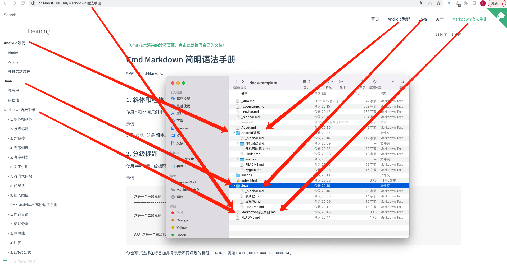
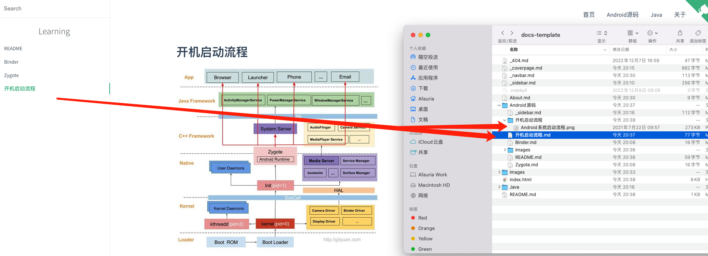
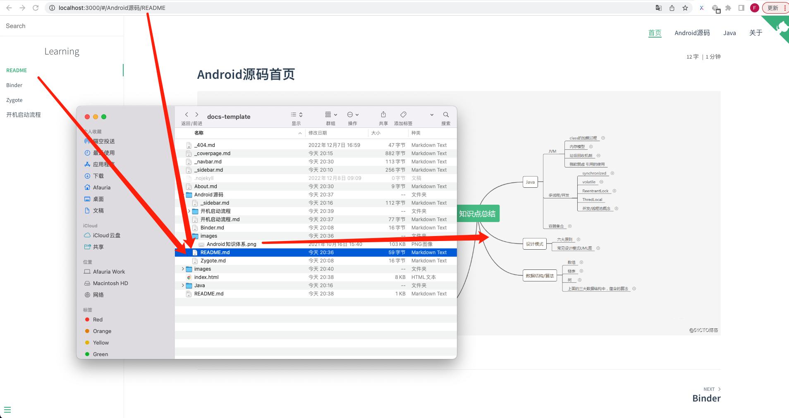

## 首页
   
一点一滴佳可贵

## 结构说明

```shell
.
├── Android源码 # 存放Android源码文章
│   ├── README.md # Android源码路径的首页：localhost:3000/Android源码
│   ├── images # 可以用于存放图片资源，markdown文章中使用相对路径引用
│   ├── Binder.md # 路径为：localhost:3000/Android源码/Binder
│   ├── Zygote.md 
│   ├── _sidebar.md  # 进入当前路径时，侧边目录栏的配置。如果没有则显示父文件夹的_sidebar.md
│   ├── 开机启动流程 # 如果希望根据文章分类图片，可以新建文件夹存放
│   └── 开机启动流程.md
├── Java # 存放Java文章
│   ├── README.md # Java路径的首页：localhost:3000/Java
│   ├── _sidebar.md # 进入当前路径时，侧边目录栏的配置。如果没有则显示父文件夹的_sidebar.md
│   ├── 多线程.md
│   └── 线程池.md
├── README.md # 首页路径：localhost:3000
├── _404.md # 404配置
├── _coverpage.md # 封面配置
├── _navbar.md # 顶部导航栏配置
├── _sidebar.md # 侧边目录栏配置
├── images # 可以用于存放图片资源
└── index.html # 站点入口和配置文件：加载的时候会执行js，解析markdown文章进行渲染
```






